# UML Diagrams for Jalpaan Express Food Delivery Application

## Use Case Diagram

```mermaid
graph TD
    U[👤 User]
    A[👨‍💼 Admin]

    UC1[Register]
    UC2[Login]
    UC3[Browse Food]
    UC4[Add to Cart]
    UC5[Remove from Cart]
    UC6[Place Order]
    UC7[Track Order]
    UC8[Update Profile]
    UC9[Contact Support]
    UC10[Add Food]
    UC11[Edit Food]
    UC12[Remove Food]
    UC13[View Orders]
    UC14[Update Order Status]
    UC15[View Users]
    UC16[View Analytics]

    U --> UC1
    U --> UC2
    U --> UC3
    U --> UC4
    U --> UC5
    U --> UC6
    U --> UC7
    U --> UC8
    U --> UC9

    A --> UC2
    A --> UC10
    A --> UC11
    A --> UC12
    A --> UC13
    A --> UC14
    A --> UC15
    A --> UC16
```



## Class Diagram


## Sequence Diagram (Order Placement)

```mermaid
sequenceDiagram
participant U as User
participant F as Frontend
participant B as Backend
participant DB as Database

U->>F: Browse food items
U->>F: Add items to cart
F->>B: POST /api/cart/add (item details)
B->>DB: Update user.cartData
DB-->>B: Success
B-->>F: Cart updated
U->>F: Proceed to place order
F->>B: POST /api/order/place (order details)
B->>DB: Verify user authentication
B->>DB: Create new order
B->>DB: Clear user.cartData
DB-->>B: Order saved
B-->>F: Order placed successfully
F-->>U: Show order confirmation